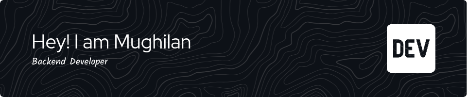

<h1 style="color:white">Hi, I'm Mughilan.</h1>
I'm a BCA Data Science student in Crescent University 
Started with frontend developement in react.
Currently learning Backend Web development in Golang.

## 🧰 Languages and Tools 

## 📈 Github Stats 

   

### Top Contibuted Repo

   

   
   

